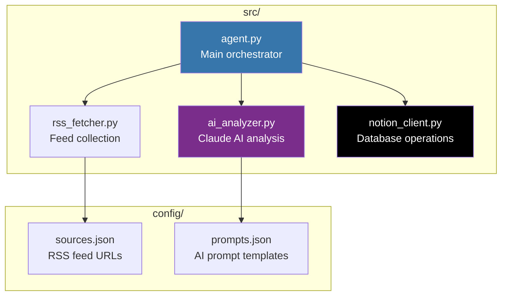

<div align="center">

# 🛡️ Cybersecurity News Intelligence Agent

[](https://claude.ai/code)
[](https://modelcontextprotocol.io/)
[](https://www.python.org/)
[]()
[](LICENSE)

**An agentic AI tool that aggregates, analyzes and rates cybersecurity news - delivering actionable intelligence directly to a Notion workspace.**

</div>

---

## 📌 Project Overview

In this Project I built an **AI-powered cybersecurity news aggregator** using Claude Code that automatically collects articles from trusted security sources, analyzes each one for relevance and actionability and delivers rated summaries directly to a Notion database.

The agent runs on-demand - when I want to catch up on security news, I execute a single command and receive a curated, prioritized feed of the most important cybersecurity developments.

> **The problem I solved:** Security professionals are overwhelmed with information. This agent cuts through the noise by using AI to rate content based on actionability, threat relevance and business impact - so you focus on what actually matters.

<br>


---

## ✨ Features

| Feature | Description |
|---|---|
| **Multi-Source Aggregation** | Pulls from 5 curated cybersecurity RSS feeds |
| **AI-Powered Analysis** | Claude AI rates each article from S-Tier to D-Tier |
| **Smart Labeling** | Automatic categorization with 25+ security-specific labels |
| **Quality Scoring** | 1–100 actionability score based on threat relevance |
| **Notion Integration** | Results stored in a structured, searchable database |
| **On-Demand Execution** | Run when you want to catch up — no always-on infrastructure |
| **Deduplication** | Skips articles already processed to avoid duplicates |

---

## 🏗️ Architecture

The agent follows a simple but powerful pipeline: **Collect → Analyze → Store**.


### Data Flow

1. **RSS Fetcher** - Collects latest articles from all configured sources
2. **Deduplicator** - Checks Notion to skip already-processed articles
3. **AI Analyzer** - Claude analyzes each article for threat relevance, actionability, and assigns ratings
4. **Notion Client** - Stores results with full metadata

### Component Diagram



---

## ⭐ Rating System

The AI rates each article using a tier system based on actionability and threat relevance:

| Tier | Label | Criteria | Action |
|---|---|---|---|
| 🔴 **S Tier** | Must Read Immediately | Active exploitation, critical CVE, major breach | Drop everything |
| 🟠 **A Tier** | Read This Week | Important vulnerability, actionable guidance | Schedule time |
| 🟡 **B Tier** | Read When Available | Educational, moderate relevance | Queue for later |
| 🔵 **C Tier** | Low Priority | Niche topic, limited actionability | Skim or skip |
| ⚪ **D Tier** | Skip | Marketing, outdated, or noise | Ignore |

### Rating Criteria

The AI evaluates articles against these factors:

| Factor | Weight | Description |
|---|---|---|
| **Active Exploitation** | High | Is this being exploited in the wild? |
| **Severity** | High | CVSS score, potential impact |
| **Breadth of Impact** | Medium | How many organizations affected? |
| **Actionability** | High | Can I do something with this today? |
| **Timeliness** | Medium | Is this breaking or old news? |
| **Source Authority** | Low | Official advisory vs. blog post |

---

## 📡 Data Sources

| Source | Type | Content Focus |
|---|---|---|
| **CIS (MS-ISAC)** | Advisories | Security advisories, best practices |
| **CISA** | Government | Official US alerts, KEV catalog |
| **Krebs on Security** | Journalism | Investigative cybercrime reporting |
| **BleepingComputer** | News | Broad security news coverage |
| **The Hacker News** | News | Vulnerabilities, breaches, tools |

---

## 🏷️ Content Labels

Articles are automatically tagged with relevant categories:

```
Vulnerabilities    Threat Intel      Malware           Ransomware
Phishing           Data Breach       Cloud Security    Identity & Access
Network Security   Endpoint Security Compliance        Privacy
Incident Response  Patch Management  Zero-Day          APT
Supply Chain       Critical Infrastructure             Government
Financial Services Healthcare        Best Practices    Tools & Techniques
Career             Industry News
```

---

## 📁 Repository Structure

```
Cybersecurity-News-Agent/
├── README.md
├── requirements.txt
├── .env.example
├── docs/
│   ├── setup-guide.md
│   └── architecture.md
├── src/
│   ├── agent.py
│   ├── rss_fetcher.py
│   ├── ai_analyzer.py
│   └── notion_client.py
├── config/
│   ├── sources.json
│   └── prompts.json
└── LICENSE
```

---

## 🧠 Skills Demonstrated

- **Agentic AI Development** - Building autonomous tools with Claude Code
- **MCP Integration** - Connecting AI to external services via Model Context Protocol
- **Python Automation** - RSS parsing, API integration, data processing
- **AI Prompt Engineering** - Structured analysis prompts for consistent output
- **API Integration** - Notion API for persistent storage
- **Cybersecurity Domain Knowledge** - Curating authoritative, relevant sources

---

## 🔮 Future Enhancements

| Enhancement | Description |
|---|---|
| **Scheduled Execution** | Daily automated runs via cron or cloud scheduler |
| **Email Digest** | Morning summary of S-Tier and A-Tier articles |
| **Slack Integration** | Post critical alerts to a security channel |
| **CVE Enrichment** | Auto-lookup CVE details from NVD |
| **Trend Analysis** | Track topics over time, identify emerging threats |

---

<div align="center">

**franciscovfonseca** · [GitHub](https://github.com/franciscovfonseca) · [LinkedIn](https://linkedin.com/in/intfranciscofonseca)

[](LICENSE)

</div>
